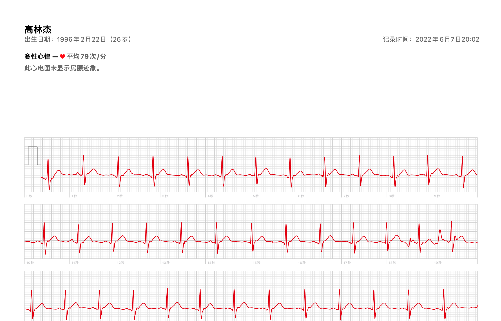
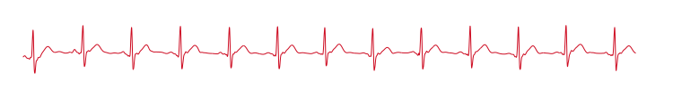

<script setup>
import Heart from '../src/components/Heart.vue'
</script>

<Heart />

# 心率动画

目标是画一个根据真实心率跳动的心脏

## 准备

- 跳动的心脏
- Apple Watch
- 生成心率图
- 分析心跳曲线，生成动画方案
- 画图

## 生成心率图

Apple Watch 现在支持了收集心率信息绘制 pdf 报表


### 转化矢量图

观察到心率曲线放大有断点，预计是用矢量图绘画，上网搜了一下 pdf 转 svg 的方案，找到一个在线网站
https://cloudconvert.com/pdf-to-svg
尝试直接转换成 svg 成功。

### 提取对应曲线片段代码

我们需要去掉多余部分只保留心跳曲线部分，阅读 svg 代码即可，转换结果比较清晰。

提取内容后会有大量留白，调整大小即可



## 分析心跳曲线 生成动画方案

### 采样数据点

参考[这篇文章](https://tympanus.net/codrops/2022/01/19/animate-anything-along-an-svg-path/)，使用 `getTotalLength`
和 `getPointAtLength` 取样。

```typescript

export function sample(g: SVGGeometryElement, precision: number = 0.1): Point[] {
  const res: Point[] = [];
  const length = g.getTotalLength();
  let i: number;
  for (i = 0; i < length; i += precision) {
    const { x, y } = g.getPointAtLength(i);
    res.push({ x, y });
  }

  if (i > length) {
    const { x, y } = g.getPointAtLength(length);
    res.push({ x, y });
  }

  return res;
}
```

数据采样后，直接将横纵坐标线性映射到 `[0, 1]` 区间即可。

```typescript
export function normalize(points: Point[]): Point[] {
  const { min: { x: minX, y: minY }, max: { x: maxX, y: maxY } } = statistics(points);
  const lx = maxX - minX;
  const ly = maxY - minY;
  return points.map(({ x, y }) => ({
    x: (x - minX) / lx,
    y: (y - minY) / ly,
  }));
}
```

### 生成动画方案

将心跳曲线横坐标视为时间，纵坐标视为动画幅度，即可生成一个单维度动画幅度的方案。其中有一个问题，由于采样函数在曲线长度上是等差，横坐标可能分布不均匀，
使用线性插值的方式计算计算实际动画幅度。

使用 `requestAnimationFrame` 控制动画过程

```typescript
import { linear, Point } from "./sample";

export type AnimationCallback = (point: Point) => void
export type AnimationCanceller = (newDuration?: number) => void

export interface AnimationFunction {
  (cb: AnimationCallback): AnimationCanceller;
}

function computeFactor(points: [Point, Point], progress: number): number {
  const [a, b] = points;
  const l = b.x - a.x;
  return (progress - a.x) / l;
}

export function animate(points: Point[], duration: number, forever: boolean = true): AnimationFunction {

  return (cb) => {
    let i = 0;
    let cur: number = 0;
    let curTime: number | undefined = undefined;
    let handler: number | undefined = undefined;

    function run(progress: number) {
      let finalPoints: [Point, Point];
      while (points[i + 1].x < progress && i < points.length - 1) {
        i += 1;
      }
      if (i < points.length - 1) {
        finalPoints = [points[i], points[i + 1]];
      } else {
        finalPoints = [points[i], points[i]];
      }

      cb(linear(finalPoints, computeFactor(finalPoints, progress)));

      curTime = curTime ?? performance.now();
      handler = requestAnimationFrame((time) => {
        const diff = time - curTime!;
        curTime = time;
        cur += diff / duration;
        if (cur <= 1) {
          run(cur);
        } else if (forever) {
          cur = 0;
          i = 0;
          run(cur);
        }
      });
    }

    run(cur);

    return (newDuration?: number) => {
      if (typeof newDuration !== "undefined") {
        duration = newDuration;
      } else {
        if (typeof handler !== 'undefined') {
          cancelAnimationFrame(handler);
        }
      }
    };
  };
}

```

## 画图

有了动画方程，画图就比较简单了，回调时改动对应属性即可

```typescript
const fn = animate(normalize(points), 10000);
const reset = fn(point => {
  lineLeft.value = min.x + size.x * point.x + 1.5 - indicatorSize / 2 + 'px';
  left.value = min.x + size.x * point.x - indicatorSize / 2 + 'px';
  top.value = min.y + size.y * point.y - indicatorSize / 2 + 'px';
  scale.value = 1 + point.y * 0.618;
  color.value = 127 + 255 * point.y / 2;
});
```
